# Hey, I'm Christos 👋

Thyroid surgeon by day, open-source tinkerer by night. I build tools at the intersection of medicine, spaced repetition, and self-hosted infrastructure.

## What I'm working on

- 🧠 **Spaced Repetition** — Maintaining [anki-sync-server-enhanced](https://github.com/chrislongros/anki-sync-server-enhanced), [anki-desktop-docker](https://github.com/chrislongros/anki-desktop-docker), and [anki-snapshot](https://github.com/chrislongros/anki-snapshot). Contributing to the [Open Spaced Repetition](https://github.com/open-spaced-repetition) org and building R packages for FSRS algorithm bindings ([ankiR](https://github.com/chrislongros/ankiR), [rfsrs](https://github.com/chrislongros/rfsrs)).
- 🏥 **Medical Research** — Working on my dissertation analyzing ~500 thyroid surgery cases to predict postoperative hypocalcemia. Building research database platforms as REDCap alternatives.
- 🐧 **Systems & Open Source** — Arch Linux daily driver, AUR package maintainer (medical imaging tools like xmedcon, nifticlib), and contributor to FreeBSD, TrueNAS WebUI, and OpenZFS docs.
- 🏠 **Homelab** — Running TrueNAS Scale with 80+ Docker containers (Immich, Jellyfin, qBittorrent, monitoring stacks…), Tailscale networking, ZFS storage pools, and automated backups via rclone + Garage S3.

## Stats

> Stats generated via GitHub Actions — see [workflow](.github/workflows/readme-stats.yml)

## Languages & Tools

`R` · `Rust` · `C` · `C++` · `Python` · `Bash` · `Docker` · `ZFS` · `Arch Linux` · `TrueNAS` · `FreeBSD` · `Anki` · `FSRS`

## Find me

- 🌐 [chrislongros.com](https://chrislongros.com/)
- 🐘 [@chrislongros@mastodon.social](https://mastodon.social/@chrislongros)
