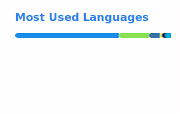

# Hi there, I'm Christos

> UNIX enthusiast · Open-source developer · AUR packager · Spaced repetition nerd

---

## About me

I am an open-source developer with a strong focus on the **FreeBSD/OpenZFS ecosystem**, **Arch Linux** packaging, and **self-hosted infrastructure**. I maintain several AUR packages, have published an R package on CRAN, and actively contribute to upstream projects in the UNIX and spaced repetition space. Alongside my development work, I build **EDC database systems** for clinical research — self-hosted alternatives to commercial platforms like REDCap.

- Ask me about **ZFS, FreeBSD, Anki, FSRS, Arch Linux, TrueNAS, Docker**
- Currently learning: **C/C++, Rust, R**
- Main interests: filesystems, storage internals, self-hosted infrastructure, spaced repetition science, EDC systems
- Blog: [chrislongros.com](https://chrislongros.com/)
- Mastodon: [@chrislongros@mastodon.social](https://mastodon.social/@chrislongros)

---

## Highlights

- **AUR maintainer** — 8 packages covering spaced repetition tooling and medical imaging, plus co-maintainer of `r-rlang`
- **CRAN author** — [ankiR](https://cran.r-project.org/package=ankiR), a comprehensive R toolkit for Anki flashcard database analysis (137 functions)
- **FreeBSD contributor** — active PRs open against [freebsd-src](https://github.com/freebsd/freebsd-src) and [freebsd-doc](https://github.com/freebsd/freebsd-doc)
- **OpenZFS contributor** — storage improvements PR currently under review
- **EDC systems developer** — self-hosted clinical data capture platforms as REDCap alternatives
- **Homelab operator** — 80+ containers on TrueNAS Scale with ZFS, Tailscale, Prometheus, and S3-compatible object storage

---

## Projects

### Anki & Spaced Repetition

| Project | Description |
|---|---|
| [**ankiR**](https://github.com/chrislongros/ankiR) | R package on CRAN — read & analyse Anki SQLite databases, retention stats, FSRS parameters (137 functions) |
| [**rfsrs**](https://github.com/chrislongros/rfsrs) | Rust/R bindings for the FSRS-6 spaced repetition algorithm |
| [**anki-snapshot**](https://github.com/chrislongros/anki-snapshot) | Git-based version control for Anki collections with human-readable diffs |
| [**anki-sync-server-enhanced**](https://github.com/chrislongros/anki-sync-server-enhanced) | Self-hosted Anki sync server — multi-user, auto-updates, web dashboard, TLS, Prometheus metrics |

### AUR Packages

| Package | Description |
|---|---|
| [`anki-snapshot`](https://aur.archlinux.org/packages/anki-snapshot) | Git-based version control for Anki collections |
| [`r-ankir`](https://aur.archlinux.org/packages/r-ankir) | Comprehensive R toolkit for Anki flashcard analysis (137 functions) |
| [`r-fsrs`](https://aur.archlinux.org/packages/r-fsrs) | R bindings for the FSRS-6 spaced repetition algorithm |
| [`nifticlib`](https://aur.archlinux.org/packages/nifticlib) | NIfTI-1 neuroimage format I/O library |
| [`xmedcon`](https://aur.archlinux.org/packages/xmedcon) | Open-source medical image conversion toolkit |
| [`python-fsrs`](https://aur.archlinux.org/packages/python-fsrs) | Free Spaced Repetition Scheduler — Python implementation |
| [`python-ankipandas`](https://aur.archlinux.org/packages/python-ankipandas) | Analyse and manipulate Anki flashcards using pandas |
| [`python-genanki`](https://aur.archlinux.org/packages/python-genanki) | Python 3 library for generating Anki decks |

*Co-maintaining:* [`r-rlang`](https://aur.archlinux.org/packages/r-rlang) — Functions for Base Types and Core R / Tidyverse Features

### Upstream Contributions

| Project | Status |
|---|---|
| [**FreeBSD/freebsd-src**](https://github.com/freebsd/freebsd-src) | PR open — kernel fix in review |
| [**FreeBSD/freebsd-doc**](https://github.com/freebsd/freebsd-doc) | Documentation improvements |
| [**OpenZFS**](https://github.com/openzfs/zfs) | PR open — storage improvements in review |
| [**TrueNAS WebUI**](https://github.com/truenas/webui) | Bug fixes merged |
| [**ankitects/anki**](https://github.com/chrislongros/anki) | Backend & frontend contributions |
| [**ankitects/anki-core-i18n**](https://github.com/ankitects/anki-core-i18n) | Fluent i18n translations |

---

## Homelab

Running a **TrueNAS Scale** homelab with:

- 80+ Docker containers managed via **Portainer**
- **ZFS** storage pools across HDDs and NVMe SSDs, with I/O-heavy workloads on dedicated SSD vdevs
- **Tailscale Serve** for secure, zero-config remote access
- **Garage** and **RustFS** for S3-compatible object storage and automated backups
- Self-hosted Anki sync server, Prometheus/Grafana monitoring stack, and EDC research platforms

---

## Tech Stack

`R` · `Rust` · `C` · `C++` · `Python` · `Bash` · `Docker` · `ZFS` · `Arch Linux` · `TrueNAS` · `FreeBSD` · `Anki` · `FSRS`

---

## Stats

